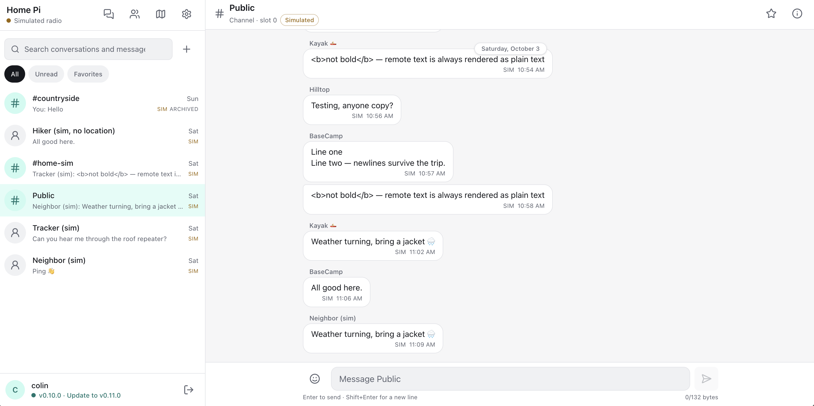
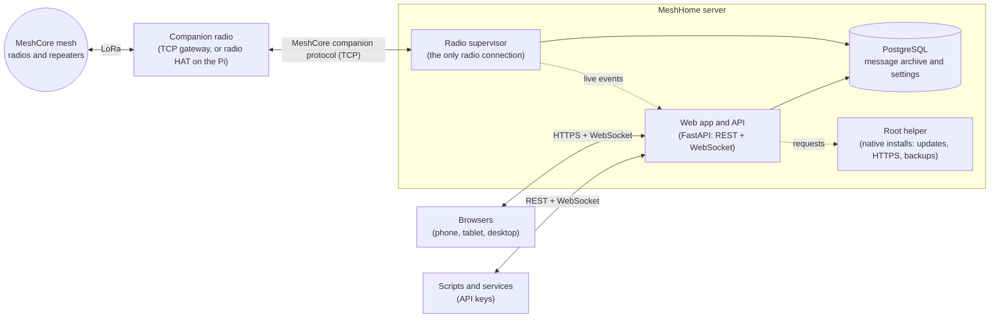

<p align="center"></p>

# MeshHome

A self-hosted web inbox for your [MeshCore](https://meshcore.io) radio. MeshHome keeps one
connection to a MeshCore companion radio, archives every message it hears in PostgreSQL (even when no
browser is open), and gives you a fast chat interface for channels and direct messages from any phone,
tablet or computer on your network.

<!-- SCREENSHOT: save a screenshot of the inbox as docs/images/inbox.png, then replace the line below with:
      -->
> 📸 *Screenshot coming soon: the inbox on desktop and phone.*

## What it does

- **Messaging:** channels and direct messages with search, unread counts, favourites, emoji, honest
  delivery states (*Sent by radio*, *Delivered*, …), and live updates in every open browser.
- **Message insight:** details for every message (SNR, RSSI, hops) and the paths it took through the
  mesh, with repeaters named from your contacts.
- **Contacts and map:** a searchable contact list that follows the radio's adverts, and a map of every
  node that shares its position.
- **Your radio's settings** from the browser: identity and location, region presets, channels (with
  QR codes and region scopes), routing and telemetry.
- **Repeater administration:** log in to your repeaters and room servers to read their status, use
  their command line and change their settings, using as little airtime as possible.
- **Bot:** query your home node from another radio with `/info`, `/ping` and `/weather` (from a local
  Ecowitt weather station).
- **API keys** for other services and scripts, with a [documented API](docs/API.md).
- **Encrypted backup and restore** of the whole installation, including moving between a Raspberry Pi
  and a container.
- **Built for a Raspberry Pi:** a guided installer, HTTPS with Let's Encrypt through 25 DNS providers,
  one-click updates with automatic rollback, and optional support for a radio HAT on the Pi itself.
- **Try it without hardware:** a built-in simulated radio produces labelled sample traffic.

The full tour is in **[Features](docs/features.md)**.

## What you need

- **A MeshCore companion radio reachable over TCP**, such as an Elecrow ThinkNode M7 or a RAK4631 with
  an Ethernet module, running MeshCore companion firmware with Ethernet (or Wi-Fi) support. On a
  Raspberry Pi, a RAK6421 radio HAT can be used instead. See [Radios](docs/radios.md).
- **Somewhere to run it:** a Raspberry Pi 4/5 or any 64-bit Debian machine (Option 1), or Docker or
  Kubernetes (Option 2).

## Installation

### Option 1: Raspberry Pi or Debian (native)

Runs directly on the operating system with its own local database. Best for a Raspberry Pi 4 or 5
with 64-bit Raspberry Pi OS, or any 64-bit Debian system.

1. **Download and run the installer** on the Pi:

   ```bash
   curl -fsSLo install.sh https://github.com/roach0816/MeshHome/releases/latest/download/install.sh
   sudo bash install.sh
   ```

2. **Follow the installer.** It checks the system, then shows every package and system change it
   will make and asks before doing anything; answering **n** cancels. It verifies the download, sets
   up the database and service, and can also set up HTTPS and a radio HAT.

   <!-- SCREENSHOT: save a screenshot of the installer dashboard as docs/images/installer.png, then replace the line below with:
         -->
   > 📸 *Screenshot coming soon: the Raspberry Pi / Debian installation wizard.*

3. **Open the address it shows** (for example `http://<pi-address>:8080`) and note the **setup
   token** it prints.
4. **Complete the setup wizard** in the browser (see [First-run setup](#first-run-setup)).
5. **Optional:** turn on HTTPS in **Settings → Network & HTTPS** if you skipped it in the installer.

Afterwards, `sudo meshhome status` checks the whole installation, and updates install from
**Settings → Software updates**. Details: [Raspberry Pi and Debian install](docs/install-native.md)
(HTTPS, radio HAT, updates, the `meshhome` command).

### Option 2: Container

**Docker Compose** (a single machine):

1. Clone this repository and create the environment file:

   ```bash
   git clone https://github.com/roach0816/MeshHome.git && cd MeshHome
   cp .env.example .env        # set POSTGRES_PASSWORD to a long random value
   ```

2. Start it and read the setup token from the log:

   ```bash
   docker compose up -d --build
   docker compose logs app | grep -A3 "setup token"
   ```

3. Open <http://localhost:8080> and complete the setup wizard.

**Kubernetes** (K3s with Rancher Continuous Delivery):

1. Create the `meshhome` namespace, the database Secret and the volumes from the
   `deploy/k8s/*.example.yaml` templates.
2. Add this repository to Rancher Continuous Delivery (Fleet) with the path `deploy/k8s`. Fleet deploys
   the app and its database, and rolls out each new build automatically.
3. Read the setup token from the app's log, port-forward, and complete the setup wizard.
4. Create the Ingress (hostname, ingress class and certificate issuer) for HTTPS.

The full walkthrough is in [Kubernetes install](docs/install-kubernetes.md).

## First-run setup

The first visit opens a short wizard. Enter the **setup token** printed by the server, which proves
you control the server so nobody else on your network can claim the app first. Then create the owner
account and choose the radio: **MeshCore TCP** (address and port), the **radio HAT** on a Pi,
**Simulated** to explore, or **Decide later**. Moving from another installation? Choose **Restore a
backup instead**.

Nothing about your installation (passwords, addresses, hostnames) is stored in this repository or the
image: it all lives in your database.

## Architecture



- **One radio owner.** A single supervisor holds the radio connection, stores each received message
  before fetching the next, and records any gaps (outages, restarts). A database lock ensures only
  one instance ever connects.
- **Browsers and scripts** use the same REST API and WebSocket; browsers sign in, scripts use API keys.
- **Least privilege on a Pi.** The app runs unprivileged and never gets root. Updates, HTTPS and
  system backups are requests that a root-owned helper re-checks before acting, with automatic
  rollback.

## Security and privacy

- Everything stays on your server: messages, contacts and settings are stored in your own database.
- Backups are always encrypted with your passphrase. Passwords are stored only as hashes, API keys as
  fingerprints, and DNS credentials only in a root-only file.
- The radio's TCP port has no password, so allow it only from the MeshHome server.
- Outbound connections are listed in [Configuration](docs/configuration.md#outbound-connections).

## Documentation

| Page | What's in it |
| --- | --- |
| [Features](docs/features.md) | Everything the app does, screen by screen |
| [Radios](docs/radios.md) | Supported radios, connecting a gateway, troubleshooting, firmware |
| [Raspberry Pi and Debian install](docs/install-native.md) | The installer in detail, HTTPS, radio HAT, updates, diagnostics |
| [Kubernetes install](docs/install-kubernetes.md) | Step-by-step K3s and Rancher setup, operations, forks |
| [Backup and restore](docs/backup-restore.md) | What's backed up, encryption, restoring between installations |
| [Configuration](docs/configuration.md) | Environment variables, map tiles and privacy, outbound connections |
| [API](docs/API.md) | Using MeshHome from other services with an API key |
| [Development](docs/development.md) | Running locally, tests, code layout, releases |

## Status

MeshHome is in active development and used daily with a real MeshCore radio over Ethernet. Some
features have so far been tested only with the simulated radio or simulated hardware, and are marked
as such in the docs. Please report what works and what doesn't on your hardware.

## Name and affiliation

MeshHome was called *MeshCore Home* until version 0.9. It is an independent project, not made or
endorsed by the MeshCore project. "MeshCore" is used only to say which radios and firmware it
works with.

## License

See [LICENSE](LICENSE). Third-party components and their licences are listed in
[THIRD_PARTY_NOTICES.md](THIRD_PARTY_NOTICES.md).
